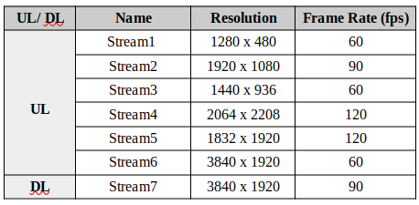

<div>
  
  
</div>
<br><br><br><br>


<!---->
<!Version 1.00 is ready for internal evaluation>

# VR-AR-CG Network Traffic Datasets 
In this repository, collected network traffic datasets regarding Virtual Reality (VR), Augmented Reality (AR), and Cloud Gaming (CG), are shared publicly. 


## (1) AR Network Traffic Collection   
In this experiment, we use video streaming to simulate the AR glasses Uplink (UL) & Downlink (DL) based on the off-the-shelf glasses! All datasets are in CSV format. The AR datasets are organized into two key parts (1) Extracted from the PCAP files, and (2) Statistically generated Features' value. 


### (1-1) Experiment1 - (Mimicking VR/AR Glasses!)

In this dataset, we wanted to collect the network traffic of the Augmented Reality (AR) use case in which a user is equipped with AR glasses and moving in the scene. The frames related to the scenes are sent to the edge server for rendering (UL) and AR glasses receive the rendered video (real+digital objects) from the edge server (DL) as shown in Fig.1.

<div align="center">
  
</div>

<p align="center">
<sub>Fig.(1) AR using the VR glasses with passthrough capability such as Meta Quest (2 or 3) </sub>
</p>

In this experiment, the videos are streamed on the Wireless network with the topology, as shown in Fig.(2-1), and network traffic is collected with Tshark in PCAP format. This dataset is collected in 3459 sec (~57min and 39sec). 
The experiment is repeated two times (PCAP1 and PCAP2), so the collected PCAP files are available in PCAP1 and PCAP2 folders. All required tools and data for reproducing the experiment with different configurations are available in this repository in addition to the collected and generated CSV files. The available CSV datasets of experiment1 are organized in three sections:

    (1) PCAP1 --> Extracted the value of the feature from the collected PCAP files.

    (2) PCAP2 --> Extracted the value of the feature from the collected PCAP files.

    (3) generated statistically --> generate the value of the features statistically!

To use the AR datasets, the tree map of the AR datasets folder and files are shown below:

    └── Experiment1
        ├── PCAP1
        │   ├── DS3_Myfile_1280_480_60.csv
        │   ├── DS3_Myfile_1440_936_60.csv
        │   ├── DS3_Myfile_1832_1920_120.csv
        │   ├── DS3_Myfile_1920_1080_90.csv
        │   ├── DS3_Myfile_2064_2208_90.csv
        │   ├── DS3_Myfile_3840_1920_60.csv
        │   └── DS3_Myfile_3840_1920_90.csv
        ├── PCAP2
        │   ├── Myfile_1280_480_60.csv
        │   ├── Myfile_1440_936_60.csv
        │   ├── Myfile_1832_1920_120.csv
        │   ├── Myfile_1920_1080_90.csv
        │   └── Myfile_2064_2208_90.csv
        └── Statistical Features
            ├── AR.csv
            ├── DL.csv
            └── UL.csv

To access other required tools, files, and datasets, follow the AR subsections below   


#### (1-1-1) Topology & Configuration

Two computers are connected via an access point, as illustrated in Fig.(2-1). The network traffic collected at the edge server is referred to as Uplink traffic. Subsequently, video streaming, characterized by a specific resolution and frame rate with constant encoding bitrate (20-35 Mbps), is generated and designated as Downlink traffic, as depicted in Fig.(2-2). 


<table>
  <tr>
    <td> </td>
    <td></td>
   
  </tr>
  <tr>
    <td> Fig.(2-1). Topology of the AR Network Traffic</td>
    <td>Fig.(2-2). Streams Resolution & Frame Rate</td>
  </tr>
</table>
<p align="center">
  <sub>Fig.(2). Topology and Video Streaming Specs</sub>
</p>


#### (1-1-2) Phases to Reproduce the (Experiment 1)
IPI: Inter Packet Interval between two consecutive frames
<html>
<body>
    <table>
        <tr>
            <td>(1) Generate the Video (.mp4) from the pre-collected environment frames (.PNG format) (Specific resolution, frame rate) <a href="https://github.com/dcomp-leris/VR-AR-CG-network-telemetry?tab=readme-ov-file#1-1-6-1-install-ffmpeg-xr-system-httpsffmpegorg">Install FFmpeg</a> | <a href="https://github.com/dcomp-leris/VR-AR-CG-network-telemetry?tab=readme-ov-file#1-1-6-2-generate-video-using-the-microsof-sequential-frames-xr-system">Generate Mp4</a>
 </td>
        </tr>
        <tr>
            <td>(2) Stream the Video from the system simulating the AR Glasses to the system simulating edge server as the Uplink (Specific resolution, frame rate, and bitrate)<a href = "https://github.com/dcomp-leris/VR-AR-CG-network-telemetry?tab=readme-ov-file#1-1-6-3-install-gst-launch-for-video-streaming-xr-system"> Install GStreamer </a> | <a href = "https://github.com/dcomp-leris/VR-AR-CG-network-telemetry?tab=readme-ov-file#1-1-6-4-stream-the-video-with-specific-resolution-frame-rate-encoding-and-bitrate-xr-system"> Stream the Video </a> </td>
        </tr>
        <tr>
            <td>(3) Stream the Video from the system simulating the edge server to the system simulating AR Glasses as the Downlink (Specific resolution, frame rate, and bitrate) [GStreamer is used to stream the Video such as step 2]<a href = "https://github.com/dcomp-leris/VR-AR-CG-network-telemetry?tab=readme-ov-file#1-1-6-3-install-gst-launch-for-video-streaming-xr-system"> Install GStreamer </a> | <a href = "https://github.com/dcomp-leris/VR-AR-CG-network-telemetry?tab=readme-ov-file#1-1-6-4-stream-the-video-with-specific-resolution-frame-rate-encoding-and-bitrate-xr-system"> Stream the Video </a> </td>
        </tr>
        <tr>
            <td>(4) Collect the network traffic using Tshark installed in the edge server (for Uplinik) and installed in AR Glasses (of course simulated Glasses!) <a href = "https://github.com/dcomp-leris/VR-AR-CG-network-telemetry?tab=readme-ov-file#1-1-6-5-install-the-tshark-xr_system--edge-server"> Install Tshark </a> | <a href = "https://github.com/dcomp-leris/VR-AR-CG-network-telemetry?tab=readme-ov-file#1-1-6-6-check-the-nic-name--collect-the-pcap-xr_system--edge-server"> Run the Tshark </a></td>
        </tr>
    </table>
</body>
</html>


#### (1-1-3) Tools, Required Pre-collected Datasets & collected Datasets in MP4, PCAP. and CSV Files in Experiment1 

<html>
<body>
    <table>
        <tr>
            <td>(1) Frames (PNG files) are available in <a href="https://www.microsoft.com/en-us/research/project/rgb-d-dataset-7-scenes/"> Microsoft 7 Scenes Frames Dataset </td>
        </tr>
        <tr>
            <td>(2) Generated MP4 Video Files with different Resolution and Frame Rate are available in <a href = "https://kaggle.com/datasets/a906acd0ce4c8ee03048bf10c06573547ddca5a5c775ba592306bd04038f3a56"> MP4 Files </a> </td>
        </tr>
        <tr>
            <td>(3) Network Traffic PCAP Collected are available in <a href = "https://kaggle.com/datasets/a906acd0ce4c8ee03048bf10c06573547ddca5a5c775ba592306bd04038f3a56"> PCAP1 & PCAP2 </a> </td>
        </tr>
        <tr>
            <td>(4) CSV Files Extracted the Features are available here <a href = "https://github.com/dcomp-leris/VR-AR-CG-network-telemetry/tree/main/AR%20dataset/Experiment1/PCAP1"> PCAP1 CSV Files | </a> | <a href = "https://github.com/dcomp-leris/VR-AR-CG-network-telemetry/tree/main/AR%20dataset/Experiment1/PCAP2"> PCAP2 CSV Files </a> </td>
        </tr>
              <td>(5) CSV Files Extracted the Features From Statistical Model <a href = "https://github.com/dcomp-leris/VR-AR-CG-network-telemetry/tree/main/AR%20dataset/Experiment1/Statistical%20Features"> Statistical Generated CSV Files </a> </td>
    </table>
</body>
</html>

              
#### (1-1-4) Dataset CSV Files Description 

- **Generated features** which features values are generated by the statistical model (Jhonson-Su Distribution Model) with the features including FS, IFI, and IPI and presented in AR.CSV, DL.CSV, and UL.CSV files.
    - ***`AR.csv'***: Contains 5000 samples, encompassing both Uplink (UL) and Downlink (DL) data.
    - ***`DL.csv'***: Comprises 2000 samples, specifically representing Downlink data.
    - ***`UL.csv'***: Includes 3000 samples of Uplink data.
- **Extracted Features** which is extracted from the PCAP Files with features including ID, SrcIP, DstIP, IPVersion, Protocol, PS, IPI, FlowSizeBytes, FlowSizePackets, FS, FS(PKT), NumFrames, IFI. The experiment was repeated two times, so the PCAP files collected are called PCAP1 and PCAP2. The extracted features are presented in two folders called PCAP1 and PCAP2.

#### (1-1-5) Dataset Features Description
Features are defined as below:

- **ID:** The Unique Flow Identity
- **SrcIP:** Flow Source IP
- **DstIP:** Flow Destination IP 
- **IPVersion:** IPv4 or IPv6
- **Protocol:** UDP/TCP
- **PS:** Packet Size in Byte unit
- **IPI:** Inter Packet Interval between two Consecutive Packets
- **FlowSizeBytes:** Flow Size in Byte
- **FlowSizePackets:** Flow Size in Number of Packets unit
- **FS:** Frame Size in Byte unit
- **FS(PKT):** Frame Size in Number of Packets unit
- **NumFrames:** Number of Frames in each Flow
- **IFI:** Inter Frame Interval between two Consecutive Frames 

#### (1-1-5) General Description for Experiment1 Setup

In this experiment, we have two computer systems whose OS are **Linux ubuntu 22.04 LTS**. The computer that generates the stream as the XR (VR or AR) glasses will be called **XR system** and the computer-simulated edge server is called **edge server**. To execute the commands, the name of the [XR or edge] system will be mentioned!

***Follow the instructions to generate the video and stream in sections [1-1-2](https://github.com/dcomp-leris/VR-AR-CG-network-telemetry/edit/main/README.md#1-1-2-phases-to-reproduce-the-experiment-1)***


## (2) CG traffic collection

To collect Cloug Gaming network telemtry data, we use a device between the CG server and clients (players). This device, called Raspberry Pi (having P4Pi system installed), runs a virtual switch and it can collect InBand Network Telemetry data and Packet Captures.

In the moment we are using only Xbox Cloud Gaming server in our experiments.

### (2-1) Experiments

- Our experiments were made on two different network connections, **5G network** and **optical fiber wired connection**.
- We collected at the moment data about three diferent games, that are: Fortnite, Forza Horizon 5 and Mortal Kombat 11. 
- For each one, we played in one or two players.

We made different experiments switching those variables, and collected InBand Network Telemtry (INT) data, more especially the depth of the (virtual, emulated by Raspberry Pi) switch  queue of packets, and the timedelta that the packets stays in it. Beside that, we also collect pcap, using Raspberry Pi too.

### (2-2) Setup

Our setup is based in Raspberry Pi (Model 4), and one or two laptops.

#### (2-2-1) Raspberry Pi setting

For Raspberry Pi we installed P4Pi system, a platform that allows to design and deploy network data planes written in P4 language using this device. You can know more about and find tutorials about how to install and manage it [here](https://github.com/p4lang/p4pi/wiki). P4Pi runs a virtual switch, and you can choose two different targets, T4P4S and BMv2. We use **BMv2**. After setting it, we created and deployed in BMv2 a P4 program able to parse our INT header in a packet, save all INT data in it, and then deparse the header and send the packet back to our host. To finish Raspberry Pi configuration, we set the rate that the queues process packets:

    # sudo simple_switch_CLI
    # set_queue_rate 2000

For the experiments until now, we use value 2000 (packets processes by second). To collect pcap of the experiments, we use **tshark** in the Raspberry Pi:

    # sudo apt update
    # sudp apt install tshark
    # sudo tshark -a duration:900 exX.pcap

We set time limit in 15 min (900 seconds) for our experiments.

#### (2-2-2) INT Host laptop setting

Our host is one of the laptops, and it runs two Python programs. The first one is responsible for creating INT packets (with INT header), and sending it to the host's network interface, one packet by second. The second program sniffs the network interface waiting for the INT packets, and, by each packet received, it get the fields that we need and save the values in our time series database. We are using [InfluxDB](https://www.influxdata.com/).

#### (2-2-3) CG Client specs

To connect and play Xbox CG we use 2 laptops (laptop_1 in all experiments and laptop_2 in 2 players experiments). These are some important specs about they:

- **OS**: Windows 10 (laptop_1) / Windows 11 (laptop_2)
- **Browser to play**: Google Chrome (laptop_1) / Microsoft Edge (laptop_2)
- **Frame Rate**: 60 FPS
- **Screen Resolution**: 1366x768 (laptop_1) / 1920x1080 (laptop_2)

#### (2-2-4) Network setup

The host laptop (+ the second one just for playing) connects by Wi-Fi/wireless connection to Raspberry Pi that, in turn, connects to Internet link by cable. Obs: in the case of 5G internet connection, we use other gadget that is connected to 5G network, and it then connect this gadget to Raspbery Pi by cable.

The following figure represents our described setup:

<div align="center">
  
</div>

<p align="center">
<sub>Fig.(4) CG experiments setup </sub>
</p>
<!---->

### (2-3) Data description

#### (2-3-1) INT data files

For all experiments we have a CSV file matching to INT data collected on each one. The lines represent the data that each INT packet collected, and collumns are:

- **ID** --> ID of the experiment
- **downlink deq_qdepth** --> the depth of downlink queue when the packet was dequeued, in units of number of packets
- **downlink deq_timedelta** --> the time, in microseconds, that the packet spent in the downlink queue
- **downlink enq_qdepth** --> the depth of the downlink queue when the packet was first enqueued, in units of number of packets
- **time** --> the time that each line was wrote in our database
- **uplink deq_qdepth** --> the depth of uplink queue when the packet was dequeued, in units of number of packets
- **uplink deq_timedelta** --> the time, in microseconds, that the packet spent in the uplink queue
- **uplink enq_qdepth** --> the depth of the uplink queue when the packet was first enqueued, in units of number of packets

Obs: downlink queue is the one of the traffic **received** by the client (packets of multimedia data sent by server); and uplink queue is the one of the traffic **sent** from client (packets of player inputs commands data).

#### (2-3-2) PCAP files

For each experiment we have a PCAP file of the trace collected in Raspberry Pi interface. It can be found and downloaded [here!](https://kaggle.com/datasets/bff9c84e3e1db2659962e9ab161597059f4268d66d336f84073b59bed377528c) 

#### (2-3-3) Features extracted files

For each PCAP file, we extracted features and created CSV files with it. Features are:

- **ID:** The unique Flow identity
- **SrcIP:** Flow Source IP
- **DstIP:** Flow Destination IP 
- **IPVersion:** IPv4 or IPv6
- **Protocol:** UDP/TCP
- **PS:** Packet Size in Byte
- **IPI:** Inter Packet Interval between two consecutive frames
- **FlowSizeBytes:** Flow Size in Byte
- **FlowSizePackets:** Flow Size in Number of Packets
- **FS:** Frame Size in Byte
- **FS(PKT):** Frame Size in Number of Packets
- **NumFrames:** Number of Frames in each Flow
- **IFI:** Inter Frame Interval between two consecutive frames 


### (2-4) Dataset Structure

Below is the structure of the CG dataset. 

It is organized by the following order: Network connection > Game > Number of players > Data type > Files

```
├───5G connection
│   ├───Fortnite
│   │   ├───1 Player
│   │   │   ├───Features
│   │   │   │       ex35.csv
│   │   │   │
│   │   │   └───INT data
│   │   │           Ex35.csv
│   │   │
│   │   └───2 Players
│   │       ├───Features
│   │       │       ex39.csv
│   │       │
│   │       └───INT data
│   │               Ex39.csv
│   │
│   ├───Forza Horizon 5
│   │   ├───1 Player
│   │   │   ├───Features
│   │   │   │       ex37.csv
│   │   │   │
│   │   │   └───INT data
│   │   │           Ex37.csv
│   │   │
│   │   └───2 Players
│   │       ├───Features
│   │       │       ex40.csv
│   │       │
│   │       └───INT data
│   │               Ex40.csv
│   │
│   └───Mortal Kombat 11
│       └───1 Player
│           ├───Features
│           │       ex38.csv
│           │
│           └───INT data
│                   Ex38.csv
│
└───Wired connection
    ├───Fortnite
    │   ├───1 Player
    │   │   ├───Features
    │   │   │       ex19.csv
    │   │   │       ex20.csv
    │   │   │       ex7.csv
    │   │   │
    │   │   └───INT data
    │   │           Ex19.csv
    │   │           Ex20.csv
    │   │           Ex31.csv
    │   │           Ex7.csv
    │   │
    │   └───2 Players
    │       ├───Features
    │       │       ex21.csv
    │       │       ex22.csv
    │       │       ex23.csv
    │       │
    │       └───INT data
    │               Ex21.csv
    │               Ex22.csv
    │               Ex23.csv
    │
    ├───Forza Horizon 5
    │   ├───1 Player
    │   │   ├───Features
    │   │   │       ex10.csv
    │   │   │       ex11.csv
    │   │   │       ex29.csv
    │   │   │       ex8.csv
    │   │   │
    │   │   └───INT data
    │   │           Ex10.csv
    │   │           Ex11.csv
    │   │           Ex29.csv
    │   │           Ex8.csv
    │   │           Ex9.csv
    │   │
    │   └───2 Players
    │       ├───Features
    │       │       ex15.csv
    │       │       ex16.csv
    │       │       ex17.csv
    │       │
    │       └───INT data
    │               Ex15.csv
    │               Ex16.csv
    │               Ex17.csv
    │               Ex18.csv
    │
    └───Mortal Kombat 11
        ├───1 Player
        │   ├───Features
        │   │       ex12.csv
        │   │       ex13.csv
        │   │       ex14.csv
        │   │       ex24.csv
        │   │       ex25.csv
        │   │       ex30.csv
        │   │
        │   └───INT data
        │           Ex12.csv
        │           Ex13.csv
        │           Ex14.csv
        │           Ex24.csv
        │           Ex25.csv
        │           Ex30.csv
        │
        └───2 Players
            ├───Features
            │       ex32.csv
            │       ex33.csv
            │       ex34.csv
            │
            └───INT data
                    Ex32.csv
                    Ex33.csv
                    Ex34.csv
```


## (3) Install Tools & Run the Experiments    

### (3-1) Install FFmpeg [XR system]! [https://ffmpeg.org/]  
This tool uses a set of frames (in PNG format) to generate video in a specific frame rate and resolution!

    $ sudo apt-get update && sudo apt-get dist-upgrade
  
    $ sudo apt-get install ffmpeg

    $ ffmpeg -version
    
**Output:**


### (3-2) Generate Video using the Microsoft Sequential Frames! [XR system]

    $ ffmpeg -r [frame rate] -f image2 -s [resolution] -i [sequence of png files] -vcodec libx264 -crf 25 -pix_fmt yuv420p [video name in mp4]
 
 - ***[frame rate]*** -- > e.g. 30, 60, 90, 120 (fps)
 - ***[resolution]*** --> e.g. 1920x1080 
 - ***[sequence of png files]*** --> e.g. img%03d.png  (for the files with img001.png, img002.png, ... , img999.png)
 - ***[video name in mp4]*** --> e.g. my_video_1920_1080.mp4
 - ***libx264*** --> -vcodec libx264 is to set the encoding

**For example:**

**Output:**


### (3-3) Install GStreamer (gst-launch) for Video Streaming [XR system]
[https://gstreamer.freedesktop.org/documentation/installing/on-linux.html?gi-language=c]

    $ sudo apt-get install libgstreamer1.0-dev libgstreamer-plugins-base1.0-dev libgstreamer-plugins-bad1.0-dev gstreamer1.0-plugins-base gstreamer1.0-plugins-good gstreamer1.0-plugins-bad gstreamer1.0-plugins-ugly gstreamer1.0-libav gstreamer1.0-tools gstreamer1.0-x gstreamer1.0-alsa gstreamer1.0-gl gstreamer1.0-gtk3 gstreamer1.0-qt5 gstreamer1.0-pulseaudio

### (3-4) Stream the Video (Using GStreamer) with Specific resolution, frame rate, encoding, and Bitrate [XR system]**

    $ gst-launch-1.0 -v filesrc location=./video1080_30.mp4 ! decodebin ! videoconvert ! videoscale ! video/x-raw,width=1920,height=1080 ! videorate ! video/x-raw,framerate=60/1 ! x264enc tune=zerolatency bitrate=5000 ! rtph264pay config-interval=1 pt=96 ! udpsink host=[IP address] port=[Port#]
    

- ***[location=./video1080_30.mp4]*** --> location of the video
- ***[width=1920,height=1080]***-->  resolution for streaming (This option can be neglected because it depends on the resolution of the video!)
- ***[framerate=60/1]*** --> frame rate of the streaming (This option can be neglected because it depends on the frame rate of the video!)
- ***[x264enc]*** --> The encoding which is H.264
- ***[bitrate=5000]*** --> It is the bitrate of sampling! (More bitrate higher sampling and higher video quality!)
- ***[rtph264pay]*** --> It is RTP protocol with H.264  encoding!
- ***[IP address]*** --> the edge server IP address e.g. 192.168.10.2
- ***[Port#]*** --> the port number e.g. 5000

**Output:**


### (3-5) Install the Tshark [XR_System & Edge Server]
      
      $ sudo apt update
  
      $ sudo apt install tshark

### (3-6) Check the NIC Name & Collect the PCAP [XR_System & Edge Server]
     
      $ ip addr
  
      $ sudo tshark -i eth0 -w capture.pcap
  
      $ tshark -i 4 -a duration:180 -w "E:\Postdoc_UFScar\MyARCode\Codes\Ver2.01_202401\Simulation tools\myfile.pcap"

