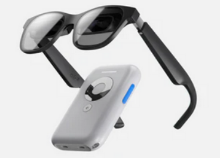
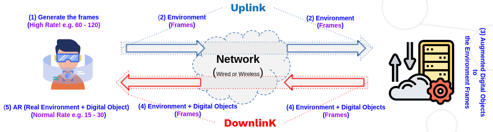
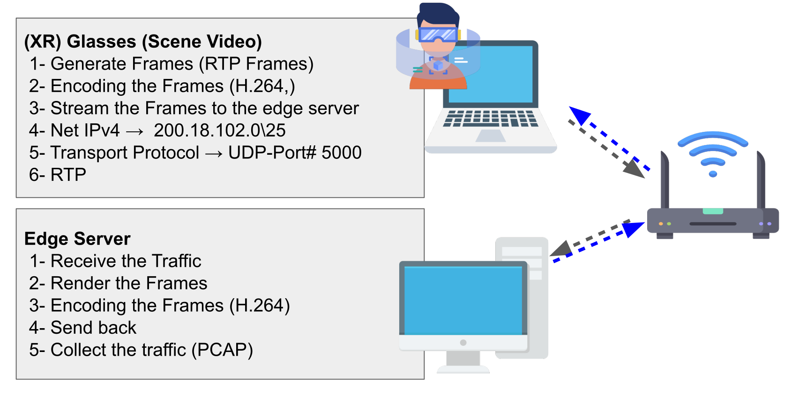
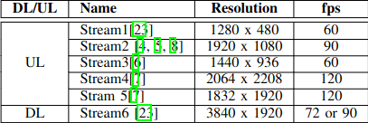

# VR-AR-CG-Network Telemetery 
In this repository, collected network traffic datasets regarding Virtual Reality (VR), Augmented Reality (AR), and Cloud Gaming (CG), are shared publicly. 

## (1) AR traffic collection   
In this experiment, we use streaming the video to simulate the AR glasses Uplink (UL) & Downlink (DL) based on the off-the-shelf glasses! All datasets are in CSV format and either were generated statistically or extracted from the collected PCAP.

  
   

  

### (1-1) Experiment1 - (without VR/AR glasses)

In this dataset, we wanted to collect the network traffic of the Augmented Reality (AR) use case in which a user is equipped with AR glasses and moving in the scene. The frames related to the scenes are sent to the edge server for rendering (UL) and AR glasses receive the rendered video (real+digital objects) from the edge server (DL). 

  

Fig.(1) AR using the VR glasses with passthrough capability such as Meta Quest (2 or 3) 

#### (1-1-1) Methodology

Two computers are connected via an access point, as illustrated in Fig.2. The network traffic collected at the edge server is referred to as Uplink traffic. Subsequently, video streaming, characterized by a specific resolution and frame rate with constant encoding bitrate (20-35 Mbps), is generated and designated as Downlink traffic, as depicted in Fig.3.

  

Fig.(2). Topology of the AR Network Traffic

  

Fig(3). Streams Resolution & Frame Rate

**The steps in this experiment are:**

<html>
<body>
    <table>
        <tr>
            <td>(1) Generate the Video (.mp4) from the pre-collected environment frames (.PNG format) (Specific resolution, frame rate) <a href="https://github.com/dcomp-leris/VR-AR-CG-network-telemetry/blob/main/README.md#L98">How to generate</a>
 </td>
        </tr>
        <tr>
            <td>(2) Stream the Video from the system simulating the AR Glasses to the system simulating edge server as the Uplink (Specific resolution, frame rate, and bitrate)</td>
        </tr>
        <tr>
            <td>(3) Stream the Video from the system simulating the edge server to the system simulating AR Glasses as the Downlink (Specific resolution, frame rate, and bitrate)</td>
        </tr>
        <tr>
            <td>(4) Collect the network traffic using Tshark installed in the edge server (for Uplinik) and installed in AR Glasses (of course simulated Glasses!) (for Downlink)</td>
        </tr>
    </table>
</body>
</html>

#### (1-1-2) Content

Three different types of files are available for those working on AR network traffic research.

(1) The video of seven scenes using the Microsoft frames datasets https://www.microsoft.com/en-us/research/project/rgb-d-dataset-7-scenes/ are generated in specific ***frame rate*** and ***resolution*** are available in [Here](https://kaggle.com/datasets/a906acd0ce4c8ee03048bf10c06573547ddca5a5c775ba592306bd04038f3a56) with the name of `scenes.tar.xz'.

(2) The videos are streamed on the Wireless network with the topology as shown in the paper and network traffic is collected with Tshark in PCAP format. This dataset is collected in 3459 sec (~57min and 39sec). The experiment is repeated two times, so the collected PCAP files are available in PCAP1 and PCAP2 folders. These folders are compressed (PCAP1.tar.xz and PCAP2.tar.xz). [Here!](https://kaggle.com/datasets/a906acd0ce4c8ee03048bf10c06573547ddca5a5c775ba592306bd04038f3a56)

(3) The CSV datasets, created through statistical distribution with parameters outlined in the paper, are organized into three files:
- ***`AR.csv'***: Contains 5000 samples, encompassing both Uplink (UL) and Downlink (DL) data.
- ***`DL.csv'***: Comprises 2000 samples, specifically representing Downlink data.
- ***`UL.csv'***: Includes 3000 samples of Uplink data.
These files collectively feature three key metrics: Inter Packet Interval (IPI), Frame Size (FS), and Inter Frame Interval (IFI).

#### (1-1-3) Features
In the CSV files, we have three features: IPI, FS, and IFI.

- ***IPI***: The difference between the arrival times of two consecutive packets.
- ***FS***: The size of the frame transmitted over the network.
- ***IFI***: The interval between two consecutive frames.

#### (1-1-4) Setup, Generate Video Streaming, & Collect the PCAP 
In the second dataset, we have the CSV files that have been extracted from the PCAPs. The pcaps have been collected in this scenario (Fig (1),(2), and (3)) and features extracted in the csv files which CSV files are available in this repository.

***To setup ...***

In this experiment, we have two computer systems whose OS are **Linux ubuntu 22.04 LTS**. The computer which generates the stream as the XR (VR or AR) glasses will be called **XR system** and the computer simulated edge server is called **edge server**. To execute the commands, the name of the [XR or edge] system will be mentioned!

***Follow the instructions to generate the video and stream ...***

##### (1-1-4-1) Install FFmpeg [XR system]! [https://ffmpeg.org/]  
This tool uses the set of frmaes (in png format) to generate video in specific frame rate and resolution!

    # sudo apt-get update && sudo apt-get dist-upgrade
  
    # sudo apt-get install ffmpeg

    # ffmpeg -version
**Output:**

##### (1-1-4-2) Generate video using the Microsof sequential frames! [XR system]

    # ffmpeg -r [frame rate] -f image2 -s [resolution] -i [sequence of png files] -vcodec libx264 -crf 25 -pix_fmt yuv420p [video name in mp4]
 
 - ***[frame rate]*** -- > e.g. 30, 60, 90, 120 (fps)
 - ***[resolution]*** --> e.g. 1920x1080 
 - ***[sequence of png files]*** --> e.g. img%03d.png  (for the files with img001.png, img002.png, ... , img999.png)
 - ***[video name in mp4]*** --> e.g. my_video_1920_1080.mp4
 - ***libx264*** --> -vcodec libx264 is to set the encoding

**For example:**

**Output:**

##### (1-1-4-3) Install gst-launch for video streaming [XR system]
[https://gstreamer.freedesktop.org/documentation/installing/on-linux.html?gi-language=c]

    # sudo apt-get install libgstreamer1.0-dev libgstreamer-plugins-base1.0-dev libgstreamer-plugins-bad1.0-dev gstreamer1.0-plugins-base gstreamer1.0-plugins-good gstreamer1.0-plugins-bad gstreamer1.0-plugins-ugly gstreamer1.0-libav gstreamer1.0-tools gstreamer1.0-x gstreamer1.0-alsa gstreamer1.0-gl gstreamer1.0-gtk3 gstreamer1.0-qt5 gstreamer1.0-pulseaudio

##### (1-1-4-4) Stream the video with specific resolution, frame rate, encoding and bitrate [XR system]**

    # gst-launch-1.0 -v filesrc location=./video1080_30.mp4 ! decodebin ! videoconvert ! videoscale ! video/x-raw,width=1920,height=1080 ! videorate ! video/x-raw,framerate=60/1 ! x264enc tune=zerolatency bitrate=5000 ! rtph264pay config-interval=1 pt=96 ! udpsink host=[IP address] port=[Port#]
    

- ***[location=./video1080_30.mp4]*** --> location of the video
- ***[width=1920,height=1080]***-->  resolution for streaming (This option can be neglected because it depends on the resolution of the video!)
- ***[framerate=60/1]*** --> frame rate of the streaming (This option can be neglected because it depends on the frame rate of the video!)
- ***[x264enc]*** --> The encoding which is H.264
- ***[bitrate=5000]*** --> It is the bitrate of sampling! (More bitrate higher sampling and higher video quality!)
- ***[rtph264pay]*** --> It is RTP protocol with H.264  encoding!
- ***[IP address]*** --> the edge server IP address e.g. 192.168.10.2
- ***[Port#]*** --> the port number e.g. 5000

**Output:**

## (2) CG traffic collection

To collect Cloug Gaming network telemtry data, we use a gadget between the CG server and clients (players). This gadget, called Raspberry Pi (having P4Pi system installed), runs a virtual switch and it can collect InBand Network Telemetry data and Packet Captures.

In the moment we are using only Xbox Cloud Gaming server in our experiments.

### (2-1) Experiments

- Our experiments were made on two different network connections, **5G network** and **optical fiber wired connection**.
- We collected at the moment data about three diferent games, that are: Fortnite, Forza Horizon 5 and Mortal Kombat 11. 
- For each one, we played in one or two players.

We made different experiments switching those variables, and collected InBand Network Telemtry (INT) data, more especially the depth of the (virtual, emulated by Raspberry Pi) switch  queue of packets, and the timedelta that the packets stays in it. Beside that, we also collect pcap, using Raspberry Pi too.

### (2-2) Setup

Our setup is based in Raspberry Pi (Model 4), and one or two laptops.

#### (2-2-1) Raspberry Pi setting

For Raspberry Pi we installed P4Pi system, a plataform that allows to design and deploy network data planes written in P4 language using this gadget. You can know more about and find tutorials about how to install and manage it [here](https://github.com/p4lang/p4pi/wiki). P4Pi runs a virtual switch, and you can choose two different targets, T4P4S and BMv2. We use **BMv2**. After setting it, we created and deployed in BMv2 a P4 program able to parse our INT header in a packet, save all INT data in it, and then deparse the header and send the packet back to our host. To finish Raspberry Pi configuration, we set the rate that the queues process packets:

    # sudo simple_switch_CLI
    # set_queue_rate 2000

For the experiments until now, we use value 2000 (packets processes by second). To collect pcap of the experiments, we use **tshark** in the Raspberry Pi:

    # sudo tshark -a duration:900 exX.pcap

We set time limit in 15 min (900 seconds) for our experiments.

#### (2-2-2) INT Host laptop setting

Our host is one of the laptops, and it runs two Python programs. The first one is responsible for creating INT packets (with INT header), and sending it to the host's network interface, one packet by second. The second program sniffs the network interface waiting for the INT packets, and, by each packet received, it get the fields that we need and save the values in our time series database. We are using [InfluxDB](https://www.influxdata.com/).

#### (2-2-3) CG Client specs

To connect and play Xbox CG we use 2 laptops (laptop_1 in all experiments and laptop_2 in 2 players experiments). These are some important specs about they:

- **OS**: Windows 10 / Windows 11
- **Browser to play**: Google Chrome
- **Frame Rate**: 60 FPS
- **Screen Resolution**: 1366x768 / 1920x1080

#### (2-2-4) Network setup

The host laptop (+ the second one just for playing) connects by Wi-Fi/wireless connection to Raspberry Pi that, in turn, connects to Internet link by cable. Obs: in the case of 5G internet connection, we use other gadget that is connected to 5G network, and it then connect this gadget to Raspbery Pi by cable.

The following figure represents our described setup:

### (2-3) Data description

#### (2-3-1) INT data files

For all experiments we have a CSV file matching to INT data collected on each one. The lines represent the data that each INT packet collected, and collumns are:

- **ID** --> ID of the experiment
- **downlink deq_qdepth** --> the depth of downlink queue when the packet was dequeued, in units of number of packets
- **downlink deq_timedelta** --> the time, in microseconds, that the packet spent in the downlink queue
- **downlink enq_qdepth** --> the depth of the downlink queue when the packet was first enqueued, in units of number of packets
- **time** --> the time that each line was wrote in our database
- **uplink deq_qdepth** --> the depth of uplink queue when the packet was dequeued, in units of number of packets
- **uplink deq_timedelta** --> the time, in microseconds, that the packet spent in the uplink queue
- **uplink enq_qdepth** --> the depth of the uplink queue when the packet was first enqueued, in units of number of packets

Obs: downlink queue is the one of the traffic **received** by the client (packets of multimedia data sent by server); and uplink queue is the one of the traffic **sent** from client (packets of player inputs commands data).

#### (2-3-2) PCAP files

For each experiment we have a PCAP file of the trace collected in Raspberry Pi interface. It can be found and downloaded [here!](https://kaggle.com/datasets/bff9c84e3e1db2659962e9ab161597059f4268d66d336f84073b59bed377528c) 

#### (2-3-3) Features extracted files

For each PCAP file, we extracted features and created CSV files with it. Features are:

- ***IPI***: The difference between the arrival times of two consecutive packets.
- ***FS***: The size of the frame transmitted over the network.
- ***IFI***: The interval between two consecutive frames.

